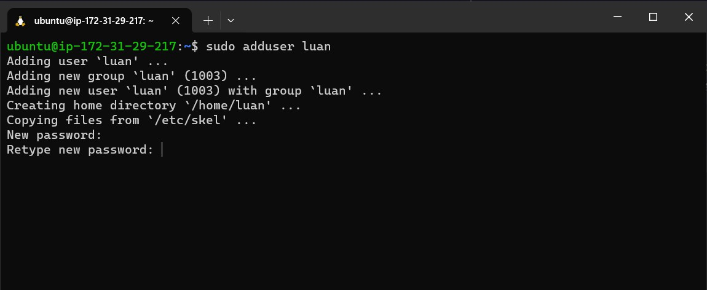
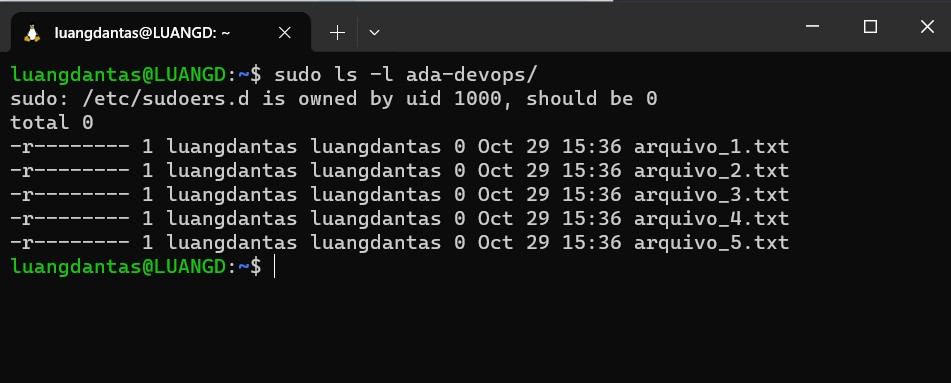

# Projeto do modulo Sistemas Operacionais Linux

Assuntos que serão abordados:

Gestão de usuários

Permissionamento

Configuração de Serviços

## Problema 1:

Imagine que a Vanessa é uma administradora de sistemas em uma empresa de tecnologia. Ela recebeu a tarefa de criar uma nova conta de usuário para um novo membro da equipe. Vanessa precisa demonstrar seu conhecimento ao explicar o processo para seus colegas de trabalho.

Descreva o processo para criar um novo usuário no Linux, incluindo os comandos e opções utilizadas de forma mais detalhada possível.

**Resolução:**

Existem duas formas de criar usuário no Linux, através do comando `adduser` ou com comando `useradd`. A forma mais recomendada é utilizando o `adduser` por oferecer mais recursos e uma usabilidade maior em comparação com o comando `useradd`.

**Utilizando o comando `adduser`:**

1- Para criar um novo usuário precisamos executar o comando `adduser` como super usuário utilizando o comando `sudo` ou através do usuário root. Substitua `nome-de-usuario` pelo nome que deseja atribuir ao novo usuário.

```bash
sudo adduser nome-de-usuario
```


2- Após executar o comando, é solicitado a senha do usuário. 



3- Em seguida, também é solicitado informações adicionais do usuário, como nome completo, número da sala, número de telefone, etc. São opcionais, então caso não queira adicionar basta pressionar Enter.


4- Ao final, informe `Y` para confirmar ou `N` para rejeitar a criação do novo usuário.


**Utilizando o comando `useradd`**

1- Neste caso, precisamos apenas executar o comando `useradd` como super usuário. Substitua `nome-de-usuario` pelo nome que deseja atribuir ao novo usuário.

```bash
sudo useradd nome-de-usuario
```


O comando `useradd` cria o usuário automaticamente de forma direta com uma senha aleatória. Com isso, para acessar o usuário e alterar sua senha é preciso realiza outras etapas através do usuário root.     

## Problema 2:

Em uma pequena cidade chamada Linuxville, vive o Lucas, um entusiasta de tecnologia. Ele está ajudando seu amigo Rafael a entender o funcionamento das permissões de arquivo no sistema Linux. Lucas decide contar uma história, explicando que os arquivos em Linux são como valiosos tesouros guardados em cofres. Cada cofre possui uma combinação única de permissões, representadas por símbolos especiais. Lucas usa essa analogia para explicar como as permissões de arquivo são representadas e qual o acesso que cada símbolo representa.

Crie uma Pasta qualquer e 5 arquivos de texto. Em seguida define as permissões `400` para a pasta e todos os arquivos recursivamente. Use esse exemplo para explicar o que são as permissões de arquivo no Linux e como elas são representadas de forma mais detalhada possível.

**Resolução:**

Execute o comando `mkdir` para criar o novo diretório/pasta. Substitua nome-diretório pelo nome que desejar.

```bash
	mkdir nome-diretorio
```

Com o comando `ls` é listada a pasta que criamos com as demais existentes.


Podemos criar os arquivos de texto dentro da nova pasta, executando para cada arquivo o seguinte comando:

```bash
tounch nome-da-pasta/nome-arquivo.txt
```

Substitua “nome-da-pasta” pelo nome da pasta criada e “nome-arquivo” pelo nome que desejar para cada arquivo. 


Ao listar os arquivo da pasta com o comando `ls`, temos os cinco arquivos de texto criado.


A pasta e os arquivos que criamos, omo toda pasta ou arquivo no Linux, possuem um conjugo de “regras” que controla quem pode fazer o quê com eles. Essas regras são chamadas de “permissões de arquivo”. Elas definem quem pode ler, escrever ou executar o arquivo.

As permissões são divididas em três grupos: proprietário (owner), grupo (group) e público/outros (public). O proprietário é o dono do arquivo, o grupo é um grupo de usuários e público/outros são todos os outros usuários no sistema. Para cada grupo pode-se definir os três tipos de permissão, ler (read), escrever (write) e executar (execute).

Executando o comando `chmod` se define a permissão do arquivo. Por exemplo, definimos as permissões `400` (somente leitura para proprietário) para a pasta e todos os arquivos, que criamos, recursivamente com seguinte o comando.

```bash
sudo chmod -R 400 nome-da-pasta
```

Executando o comando `ls` com a flag `-l` é mostrado em formato de lista as informações das pastas e arquivos, como o dono, data de criação e permissões. 

Para a pasta
 
 ```bash
 ls -l
 ```

 

 E para os arquivos

 ```bash
 sudo ls -l ada-devop/
 ```


Os tipos de permissões são representados por três letras: `r` para ler (read), `w` para escrever (write) e `x` para executar (execute). Cada grupo (proprietário, grupo e outros) tem essas três letras.

Por exemplo, na em cada item listado ao executar `ls -l`, vemos: `dr--------` ou  `-r--------`, para a pasta e os arquivos que criamos. Essa é a forma que Linux representa as permissões para cada arquivo. Podemos entender melhor através da imagem abaixo. 


São dez tracinhos, o primeiro define o tipo de arquivo, um diretório, arquivo, link, etc. Os demais tracinhos são divididos nos três grupos de permissões, proprietário, grupo e outros. Cada grupo possui três tracinhos, onde cada um representa um tipo de permissão, `r` para ler (read), `w` para escrever (write) e `x` para executar (execute). Quando definido `-` significa que essa permissão não é permitida.

Por exemplo, a representação apresentada para a pasta criada: `dr--------`, significa que se trata de um arquivo do tipo diretório e o proprietário, somente ele, tem permissão de leitura. 

Como mencionado anteriormente, a pasta e os arquivos foram definidos com esta permissão quando executamos o comando `sudo chmod -R 400 ada-devops`. A permissão foi definida utilizando a notação numérica ao passar como argumento o valor `400`. 
	
A notação numérica é uma maneira simples de representar permissões usando números. E segue a seguinte regra:
Cada dígito do número representa um grupo de usuários

  - Dígito 1: representa as permissões para o proprietário do arquivo ou diretório.

  - Dígito 2: representa as permissões para o grupo ao qual o arquivo ou diretório pertence.

  - Dígito 3: representa as permissões para todos os outros usuários.

Cada dígito é uma soma de três números, que representam as permissões para ler, escrever e executar um arquivo ou diretório.
	
  - Número 4 - representa “r”, a permissão de leitura (read)

  - Número 2 - representa “w”, a permissão de escrita (write)

  - Número 1- representa “x”, a permissão de escrita (execute)  

Exemplo:
`400`: apenas permissão de leitura para o proprietário 

|             |      Dígito 1   |     Dígito 2    |    Dígito 3     |
|-------------|-----------------|-----------------|-----------------|
|             |   proprietário  |      grupo      |      outros     |
|  **Permissões** |  r  -  w  -  x  |  r  -  w  -  x  |  r  -  w  -  x  |
|   **Números**   |  4  -  2  -  1  |  4  -  2  -  1  |  4  -  2  -  1  |
|     **Soma**    |      `4+0+0`      |      `0+0+0`      |      `0+0+0`      |
|  **Resultado**  |        `4`        |        `0`        |        `0`        | 

## Problema 3:

Em uma cidade futurística chamada Adalandia, existe uma equipe de jovens DevOps liderada pela Andreza. Eles estão trabalhando em um novo projeto e precisam configurar um servidor web para hospedar sua aplicação. Andreza, como líder do time, guia seus colegas pelo processo de instalação e configuração do servidor Nginx, compartilhando suas experiências passadas com a ferramenta e fornecendo orientações detalhadas para garantir uma configuração correta.

Descreva o processo para instalar e configurar o servidor Web Nginx no Linux. O Objetivo é alterar a página Default do Nginx para os seguintes caracteres:

ADA `+ AdaTech + seu_nome = Sucesso!`

Apenas esse texto deve ser renderizado na página padrão do servidor. Não esqueça de tirar um print e documentar tudo que foi feito até chegar a esse resultado.

**Resolução:**

O processo de instalação e configuração de um servidor web no Linux será demonstrado utilizando o Apache, como apreendido em aula.

Passos:

1- Com o terminal aberto, realizou-se a instalação do Apache através do comando abaixo como super usuário:

```bash
sudo apt install apache2
```

Ao executar o comando é solicitado uma confirmação, informe `Y` para continuar e `n` cancelar a instalação. Acima da solicitação, é mostrado todos os pacotes e dependências necessários que serão instalados junto ao Apache.


Finalizado a instalação, o serviço é iniciado automaticamente.  

2- O *status* do serviço é verificado executando o comando abaixo.

```bash
sudo systemctl status apache2
```


É mostrado que serviço está ativo e em execução. Então, o Apache será responsável por gerenciar todas as seções, acessos e desempenho da aplicação que está em execução e disponibilizada na porta 80.  

Com isso, ao acessar nossa máquina com o IP público pelo navegador, temos acesso à aplicação disponibilizada na porta 80 pelo Apache. É carregada a página de configuração padrão do Apache, como mostrado na figura abaixo.


O diretório `/var`, como sabemos, armazena os arquivos estáticos e dinâmicos utilizados pelas aplicações. Assim, ao iniciar o serviço do Apache é criado o diretório /var/www que contém todos os arquivos de configuração do serviço. 

Ao acessar o diretório `/var/www/html` e executar o comando `ls`, é listado o conteúdo padrão da aplicação, ou seja, o arquivo HTML da página padrão do Apache que é renderizada no navegador, `/var/www/html/index.html`.


3- Utilizando um editor de texto, neste caso o vim, executando do comando abaixo, podemos acessa o conteúdo do arquivo:

```bash
sudo vim /var/www/html/index.html
```

Ao abrir o arquivo, como mostrado na figura abaixo, temos todo o código e as informações da página renderizada.


4- Para alterar o conteúdo apresentado no navegador:

  Passos:

  1- Excluir o arquivo com o comando

    ```bash
    sudo rm /var/www/html/index.html 
    ```

  2- Utilizar o comando abaixo para criar e abrir o novo arquivo com o editor de texto vim

    ```bash
    sudo vim  /var/www/html/index.html 
    ```

  3- Inserir e salvar o novo conteúdo, como mostrado na imagem abaixo

  

5- Quando voltamos para o navegado, temos renderizado o conteúdo inserido, como mostrado na imagem.


